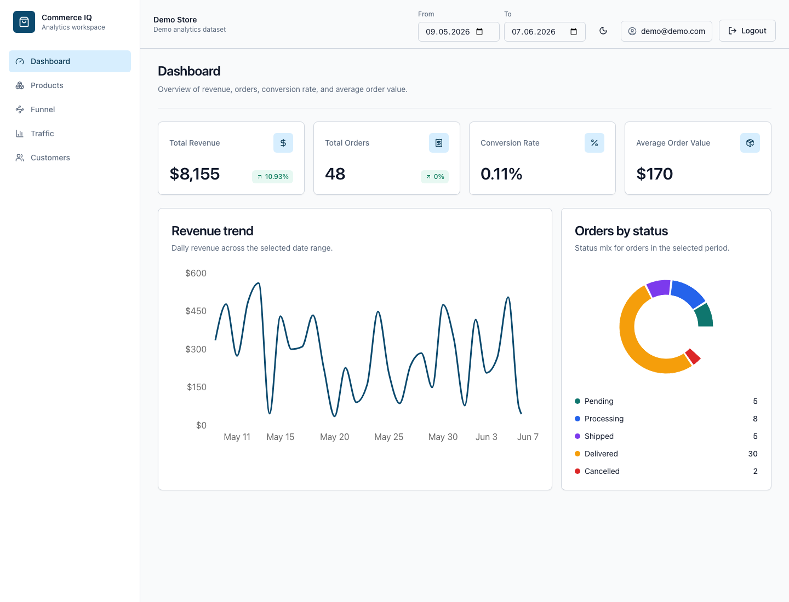
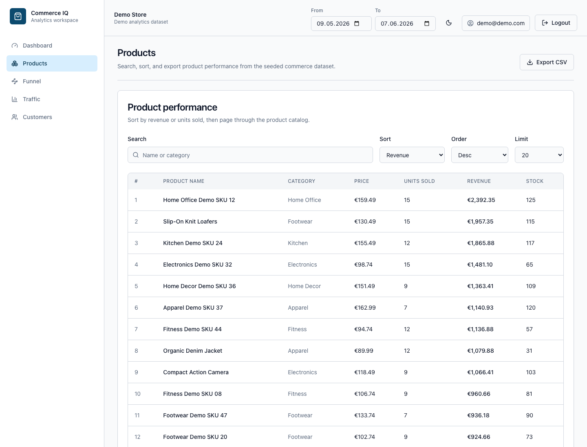
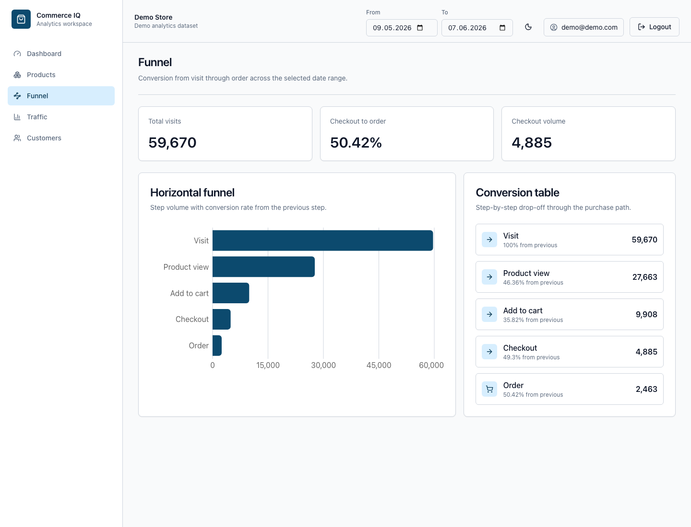
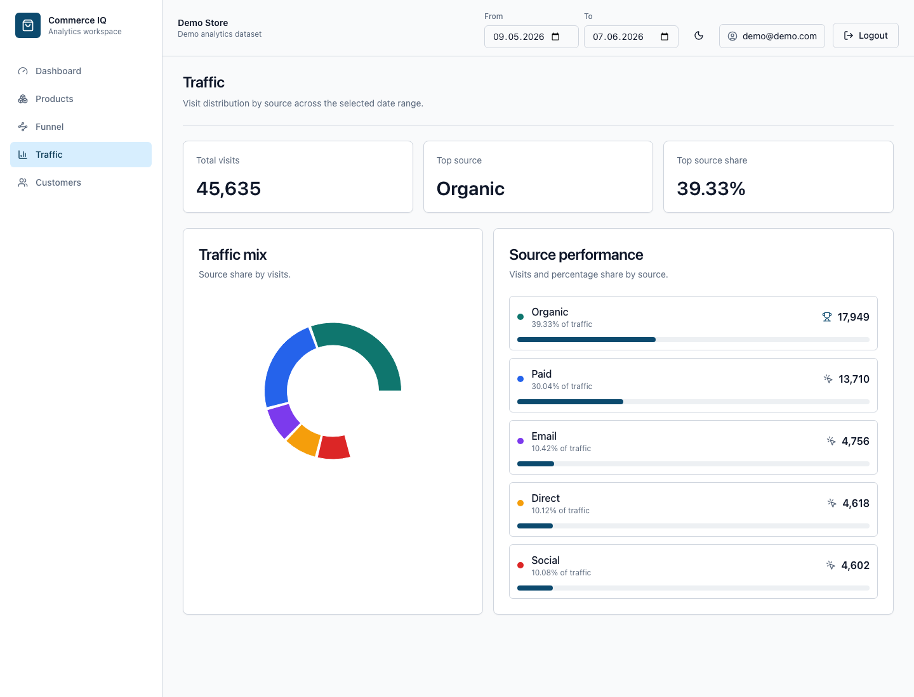
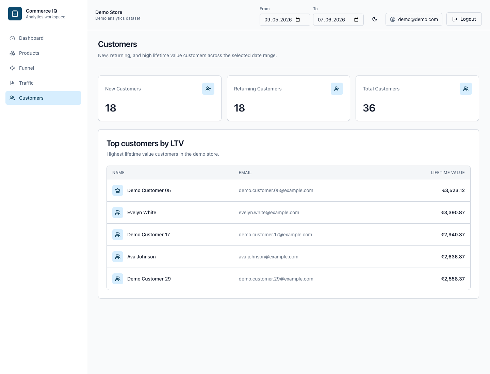

# E-Commerce Analytics Dashboard


## Overview

E-Commerce Analytics Dashboard is a full-stack MERN analytics platform for monitoring store performance from a polished, production-ready admin UI.

The project is built as a portfolio-grade SaaS dashboard: authenticated users can explore seeded commerce data, compare performance across date ranges, export product CSVs, and review revenue, funnel, traffic, product, and customer metrics from one workspace. The backend is intentionally structured around a commerce adapter so the current MongoDB demo dataset can later be swapped for a WooCommerce integration without rewriting route handlers or dashboard pages.

The application helps store owners track:

- Revenue
- Orders
- Conversion Funnel
- Product Performance
- Customer Analytics
- Traffic Sources

---

## Live Demo

Live demo link: Coming soon

Deployment targets:

- Frontend: Vercel
- Backend API: Render
- Database: MongoDB Atlas

---

## Screenshots

### Dashboard



### Products



### Funnel



### Traffic



### Customers



---

## Features

### Authentication

- JWT Authentication
- httpOnly cookies
- Protected routes
- User registration and login

### Dashboard

- Revenue, orders, conversion rate, and average order value KPI cards
- Delta badges for revenue and order movement
- Revenue trend line chart
- Orders by status donut chart
- Loading and error states for dashboard data

### Products

- Product performance
- Revenue ranking
- Inventory overview
- Search and sorting
- CSV export

### Funnel Analytics

- Visit -> Product View -> Add to Cart -> Checkout -> Order

### Traffic Analytics

- Organic traffic
- Paid traffic
- Direct traffic
- Social traffic
- Email traffic

### Customer Analytics

- New vs Returning customers
- Lifetime Value (LTV)
- Top customers

---

## Tech Stack

### Frontend

- React
- TypeScript
- Vite
- Tailwind CSS
- shadcn/ui
- Zustand
- TanStack Query
- Recharts

### Backend

- Node.js
- Express
- TypeScript
- MongoDB
- Mongoose
- JWT
- bcrypt
- Zod

---

## Architecture

```text
React Client
  |
  | httpOnly cookie auth + Axios
  v
Express API
  |
  | authMiddleware
  v
Routes
  |
  v
Dashboard Services
  |
  v
Commerce Adapter
  |
  v
MongoDB / future WooCommerce source
```

The app uses a layered architecture so request handling, analytics calculations, and data access stay separated:

- `client` owns routing, layout, auth state, query caching, charts, tables, and UI state.
- `server` owns authentication, protected API routes, analytics services, CSV streaming, and production cookie/CORS configuration.
- `shared` owns TypeScript contracts that can be imported across workspaces.
- Routes call services, services call the commerce adapter, and the adapter owns MongoDB queries.
- The current adapter reads seeded MongoDB data. A future WooCommerce adapter can implement the same contract for synced commerce data.

---

## Key Technical Decisions

- httpOnly cookie authentication keeps JWTs out of `localStorage`.
- Production cookies use `secure: true` and `sameSite: none` for Vercel-to-Render deployments, while local development keeps `sameSite: lax`.
- TanStack Query owns API caching, loading states, and refetching for dashboard pages.
- Zustand owns global UI state, including persisted theme and editable date range.
- The dashboard API follows `Routes -> Services -> Commerce Adapter -> MongoDB` to keep routes free of direct Mongoose access.
- Recharts powers portfolio-friendly visualizations without custom chart plumbing.
- Tailwind CSS and shadcn-style primitives provide a consistent, responsive SaaS interface.
- Seed data is intentionally larger than the minimum demo dataset so screenshots, pagination, charts, and exports feel realistic.

---

## Future WooCommerce Integration

Planned integration:

- Products Sync
- Orders Sync
- Customers Sync

Data Source:

WooCommerce REST API

Planned Environment Variables:

```env
MONGO_URI=
JWT_SECRET=
CLIENT_URL=
NODE_ENV=production
PORT=
WC_API_URL=
WC_CONSUMER_KEY=
WC_CONSUMER_SECRET=
```

---

## Demo Credentials

Email:

demo@demo.com

Password:

demo1234

---

## Local Development

Install dependencies

```bash
npm install
```

Run development servers

```bash
npm run dev
```

Seed database

```bash
npm run seed
```

Run tests

```bash
npm run test
```

Run linting

```bash
npm run lint
```

Run type checking

```bash
npm run typecheck
```

Build all workspaces

```bash
npm run build
```

### Local Environment

Create `server/.env` from `server/.env.example`:

```env
MONGO_URI=mongodb://localhost:27017/ecommerce_analytics_dashboard
JWT_SECRET=replace-with-a-long-random-secret
CLIENT_URL=http://localhost:5173
NODE_ENV=development
PORT=4000
```

Create `client/.env` from `client/.env.example`:

```env
VITE_API_BASE_URL=http://localhost:4000/api
```

### Production Environment

Backend environment variables:

```env
MONGO_URI=mongodb+srv://...
JWT_SECRET=<long-random-production-secret>
CLIENT_URL=https://your-vercel-app.vercel.app
NODE_ENV=production
PORT=<provided-by-host>
```

Frontend environment variables:

```env
VITE_API_BASE_URL=https://your-render-api.onrender.com/api
```

Production cookie/auth notes:

- Auth uses httpOnly cookies.
- Cookies are `secure: true` when `NODE_ENV=production`.
- Cookies use `sameSite: none` in production for Vercel-to-Render cross-site requests.
- CORS allows credentials and uses `CLIENT_URL` as the allowed frontend origin.
- Local development keeps non-secure `sameSite: lax` cookies for `localhost`.

### Vercel Frontend Deployment

The frontend is configured with `client/vercel.json`.

Vercel settings:

- Root directory: `client`
- Build command: `npm run build`
- Output directory: `dist`
- Environment variable:
  - `VITE_API_BASE_URL=https://your-render-api.onrender.com/api`

`client/vercel.json` includes an SPA fallback so direct visits to routes like `/dashboard`, `/products`, and `/customers` serve `index.html`.

### Render Backend Deployment

The backend includes `server/render.yaml`.

Render setup:

- Service type: Web Service
- Runtime: Node
- Build command:
  - `npm install && npm run build -w @ecommerce-dashboard/shared && npm run build -w @ecommerce-dashboard/server`
- Start command:
  - `npm run start -w @ecommerce-dashboard/server`
- Required environment variables:
  - `MONGO_URI`
  - `JWT_SECRET`
  - `CLIENT_URL`
  - `NODE_ENV=production`
  - `PORT`

Use MongoDB Atlas for `MONGO_URI` in production.

---

## Project Structure

```text
root
├── client
├── server
├── shared
├── package.json
├── tsconfig.base.json
└── README.md
```

The project uses npm workspaces:

- `client` - React/Vite frontend workspace
- `server` - Express API workspace
- `shared` - shared TypeScript contracts for domain entities

---

## Roadmap

Phase 1 - Project Foundation - Complete

Phase 2 - Authentication - Complete

Phase 3 - Analytics Models - Complete

Phase 4 - Seed System - Complete

Phase 5 - Dashboard API - Complete

Phase 6 - Frontend Foundation - Complete

Phase 7 - Dashboard UI - Complete

Phase 8 - Products - Complete

Phase 9 - Funnel & Traffic - Complete

Phase 10 - Customers - Complete

Phase 11 - Deployment - Complete

Phase 12 - Portfolio Polish - Complete

Phase 13 - WooCommerce Integration

Maintain README.md throughout development. After each completed phase, update the README with architecture decisions, available features, setup instructions, and progress status.

---

## Phase 1 Status

Completed foundation work:

- npm workspaces configured
- TypeScript base configuration added
- ESLint flat config added
- Prettier config added
- `client`, `server`, and `shared` workspaces created
- `.env.example` files created for client and server
- Shared domain entity contracts added:
  - `Order`
  - `Product`
  - `User`
  - `Session`
  - `FunnelEvent`
  - `Customer`

Available commands:

```bash
npm run dev
npm run lint
npm run seed
npm run test
npm run typecheck
```

## Phase 2 Status

Completed authentication work:

- MongoDB connection uses `MONGO_URI`
- User schema added with:
  - `email`
  - `passwordHash`
  - `storeName`
  - `createdAt`
- Auth endpoints added:
  - `POST /api/auth/register`
  - `POST /api/auth/login`
  - `POST /api/auth/logout`
  - `GET /api/auth/me`
- bcrypt password hashing added
- JWT signing and verification added
- httpOnly auth cookie added
- Protected route middleware added
- Zod request validation added
- Standard error response format added:

```json
{
  "error": "message",
  "field": "optional"
}
```

Manual auth test flow:

1. Copy `server/.env.example` to `server/.env`
2. Set `MONGO_URI` and `JWT_SECRET`
3. Run `npm run dev`
4. Register with `POST http://localhost:4000/api/auth/register`
5. Login with `POST http://localhost:4000/api/auth/login`
6. Verify the session with `GET http://localhost:4000/api/auth/me`
7. Logout with `POST http://localhost:4000/api/auth/logout`
8. Confirm `GET http://localhost:4000/api/auth/me` returns `401`

## Phase 3 Status

Completed analytics model work:

- Added MongoDB/Mongoose models for:
  - `Order`
  - `Product`
  - `Customer`
  - `Session`
  - `FunnelEvent`
- Added optional `externalId` fields to `Order`, `Product`, and `Customer`
- Reserved `externalId` for future WooCommerce entity IDs
- Added model indexes for query and sync readiness:
  - `userId`
  - `createdAt` on created analytics entities
  - `date` on time-series analytics entities
  - compound sparse `{ userId, externalId }` where WooCommerce mapping will apply
- Updated shared TypeScript contracts to align with backend analytics models
- Added model tests for enums, indexes, optional external IDs, and seed-compatible order structure

WooCommerce integration note:

No WooCommerce API connection is implemented in this phase. The models are only prepared for future synchronization.

## Phase 4 Status

Completed seed system work:

- Added `server/scripts/seed.ts`
- Added root `npm run seed` command
- Seed script drops and recreates the target MongoDB database
- Seed script is idempotent
- Demo user is created with bcrypt password hashing:
  - Email: `demo@demo.com`
  - Password: `demo1234`
  - Store Name: `Demo Store`
- Generated related demo analytics data:
  - 100 products
  - 60 customers
  - 300 orders
  - 180 session records
  - 900 funnel event records across 180 days
- Orders are linked to customers and products
- Order totals are calculated from product item prices
- `externalId` remains unset for products, customers, and orders until WooCommerce integration exists
- Added seed tests for counts, relationships, idempotency, password hashing, order totals, and funnel progression

Latest seed statistics:

```text
users:        1
products:     100
customers:    60
orders:       300
sessions:     180
funnelEvents: 900
```

Manual seed test flow:

1. Copy `server/.env.example` to `server/.env` if needed
2. Set `MONGO_URI`
3. Run `npm run seed`
4. Confirm the command prints the expected seed statistics
5. Re-run `npm run seed` and confirm the same statistics are printed again

## Phase 5 Status

Completed dashboard API work:

- Added protected REST endpoints under `/api`
- All dashboard routes use auth middleware
- Routes call services, services call the commerce adapter, and the adapter owns MongoDB access
- Added overview endpoint:
  - `GET /api/dashboard/overview?from=YYYY-MM-DD&to=YYYY-MM-DD`
- Added product endpoint:
  - `GET /api/products?sort=revenue|units&order=asc|desc&search=&page=1&limit=20`
- Added funnel endpoint:
  - `GET /api/funnel?from=YYYY-MM-DD&to=YYYY-MM-DD`
- Added traffic endpoint:
  - `GET /api/traffic?from=YYYY-MM-DD&to=YYYY-MM-DD`
- Added customer endpoint:
  - `GET /api/customers?from=YYYY-MM-DD&to=YYYY-MM-DD`
- Added CSV export endpoint:
  - `GET /api/export/csv?entity=orders|products&from=YYYY-MM-DD&to=YYYY-MM-DD`

The overview endpoint now returns:

```json
{
  "revenue": 6328.55,
  "orders": 48,
  "cvr": 0.06,
  "aov": 131.84,
  "revenueDelta": 100,
  "ordersDelta": 100,
  "revenueChart": [{ "date": "2026-05-01", "revenue": 405.46 }],
  "orderStatusChart": [{ "status": "delivered", "count": 30 }]
}
```

## Phase 6 Status

Completed frontend foundation work:

- Added React Router v6 routes for:
  - `/login`
  - `/register`
  - `/dashboard`
  - `/products`
  - `/funnel`
  - `/traffic`
  - `/customers`
- Added auth context and protected route handling
- Added Axios API client with `withCredentials: true`
- Added TanStack Query provider
- Added Zustand global store for:
  - `theme`
  - `dateRange`
- Added persisted light/dark mode support
- Added Tailwind CSS setup
- Added shadcn-style UI primitives:
  - `Button`
  - `Card`
  - `Input`
  - `Label`
- Added app layout with sidebar and topbar
- Added placeholder protected pages
- Added root error boundary

## Phase 7 Status

Completed dashboard UI work:

- Replaced the dashboard placeholder with a real dashboard page
- Connected the page to:
  - `GET /api/dashboard/overview?from=YYYY-MM-DD&to=YYYY-MM-DD`
- Uses TanStack Query and the shared Axios client
- Uses the global Zustand `dateRange`
- Added KPI cards for:
  - Total Revenue
  - Total Orders
  - Conversion Rate
  - Average Order Value
- Added loading skeletons and error fallbacks
- Added revenue `LineChart` using Recharts
- Added orders by status donut chart using Recharts
- Added backend `orderStatusChart` data to the overview response
- Kept existing overview response fields unchanged
- Dark and light mode styling is supported by the shared theme tokens

Dashboard screenshot:


Known limitations:

- Dashboard charts use seeded demo data only
- WooCommerce integration is not implemented yet

## Phase 8 Status

Completed products page work:

- Replaced the products placeholder with a real products table page
- Connected the page to:
  - `GET /api/products?sort=revenue|units&order=asc|desc&search=&page=1&limit=20`
- Uses TanStack Query and the shared Axios client
- Added 300ms debounced search by product name or category
- Added sort controls for:
  - Revenue
  - Units
- Added order controls for:
  - Asc
  - Desc
- Added pagination and page size controls
- Added responsive products table with:
  - Row number
  - Product name
  - Category
  - Price
  - Units sold
  - Revenue
  - Stock
- Price and revenue values are formatted as EUR in the UI
- Added low-stock badge for products with stock below 10
- Added loading skeletons, empty state, and error state
- Added CSV export button using:
  - `GET /api/export/csv?entity=products`
- CSV export downloads through the browser with the existing httpOnly cookie session
- Dark and light mode styling remains supported by shared theme tokens

Known limitations:

- Product data still comes from seeded demo records
- CSV export uses the backend's default date range unless date filters are added to the UI
- Product table does not yet include product detail drill-downs or inventory actions

## Phase 9 Status

Completed funnel and traffic page work:

- Replaced the funnel placeholder with a real funnel analytics page
- Connected the funnel page to:
  - `GET /api/funnel?from=YYYY-MM-DD&to=YYYY-MM-DD`
- Uses TanStack Query and the shared Axios client
- Uses the global Zustand `dateRange`
- Added funnel summary cards
- Added horizontal Recharts `BarChart` in a `ResponsiveContainer`
- Added step-by-step conversion table for:
  - Visit
  - Product View
  - Add To Cart
  - Checkout
  - Order
- Shows count and conversion rate from the previous step
- Added loading skeleton, error state, and empty state
- Replaced the traffic placeholder with a real traffic analytics page
- Connected the traffic page to:
  - `GET /api/traffic?from=YYYY-MM-DD&to=YYYY-MM-DD`
- Added traffic source summary cards
- Added Recharts donut chart in a `ResponsiveContainer`
- Added traffic source performance list with visits and percentage share
- Added top source summary
- Added loading skeleton, error state, and empty state
- Dark and light mode styling remains supported by shared theme tokens

Known limitations:

- Funnel and traffic data still comes from seeded demo records
- WooCommerce integration is not implemented yet

## Phase 10 Status

Completed customers page work:

- Replaced the customers placeholder with a real customers page
- Connected the page to:
  - `GET /api/customers?from=YYYY-MM-DD&to=YYYY-MM-DD`
- Uses TanStack Query and the shared Axios client
- Uses the global Zustand `dateRange`
- Added summary cards for:
  - New Customers
  - Returning Customers
  - Total Customers
- Added top customers by LTV table with:
  - Name
  - Email
  - Lifetime Value
- Lifetime value is formatted as EUR in the UI
- Added loading skeletons, error state, and empty state
- Dark and light mode styling remains supported by shared theme tokens

Known limitations:

- Customer data still comes from seeded demo records
- Customer detail drill-downs are not implemented yet
- WooCommerce integration is not implemented yet

## Phase 11 Status

Completed deployment readiness work:

- Added root build script:
  - `npm run build`
- Added client build script:
  - `npm run build -w @ecommerce-dashboard/client`
- Added server build and start scripts:
  - `npm run build -w @ecommerce-dashboard/server`
  - `npm run start -w @ecommerce-dashboard/server`
- Root build compiles:
  - shared contracts
  - Vite client app
  - bundled Node/Express server
- Updated server environment example with:
  - `MONGO_URI`
  - `JWT_SECRET`
  - `CLIENT_URL`
  - `NODE_ENV`
  - `PORT`
- Updated client environment example with:
  - `VITE_API_BASE_URL`
- Added `client/vercel.json` with:
  - Vite build output directory
  - SPA fallback to `index.html`
- Added `server/render.yaml` for Render setup
- Updated production CORS to allow credentials from `CLIENT_URL`
- Updated auth cookies for production:
  - `httpOnly: true`
  - `secure: true` when `NODE_ENV=production`
  - `sameSite: none` in production for cross-domain frontend/backend deployments
  - local development remains compatible with non-secure `sameSite: lax` cookies

Known deployment notes:

- The frontend and backend are intended to deploy separately.
- Set `VITE_API_BASE_URL` in Vercel to the deployed Render API URL with `/api`.
- Set `CLIENT_URL` in Render to the deployed Vercel frontend URL.
- Use MongoDB Atlas for production `MONGO_URI`.
- Do not use demo secrets in production.
- Vite may warn about large chunks during build; this is acceptable for the current portfolio app and can be optimized later with code splitting.

## Phase 12 Status

Completed portfolio polish work:

- Added README badges for TypeScript, React, Node.js, and MongoDB Atlas
- Added a Live Demo section for the future deployed app link
- Captured real authenticated app screenshots for:
  - Dashboard
  - Products
  - Funnel
  - Traffic
  - Customers
- Improved the README overview and project story
- Expanded the architecture section with the frontend, API, service, adapter, and data-source flow
- Added key technical decisions covering auth, cookies, query caching, state, adapter boundaries, charts, styling, and seed data
- Added editable global date range controls to the topbar
- Increased production demo seed data to:
  - 100 products
  - 60 customers
  - 300 orders
  - 180 sessions
  - 900 funnel events
- Re-seeded the demo database with the larger dataset

Known portfolio notes:

- The Live Demo link is a placeholder until the Vercel and Render deployments are published.
- Screenshots are generated from the local seeded demo user.
- WooCommerce integration is still planned for the next phase.

Next phase:

Phase 13 - WooCommerce Integration
